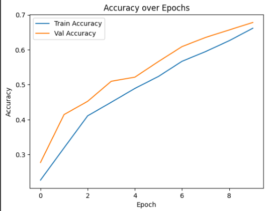
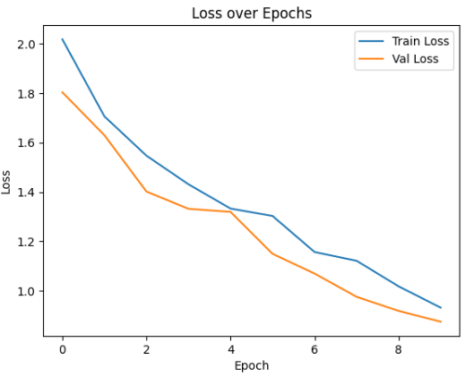
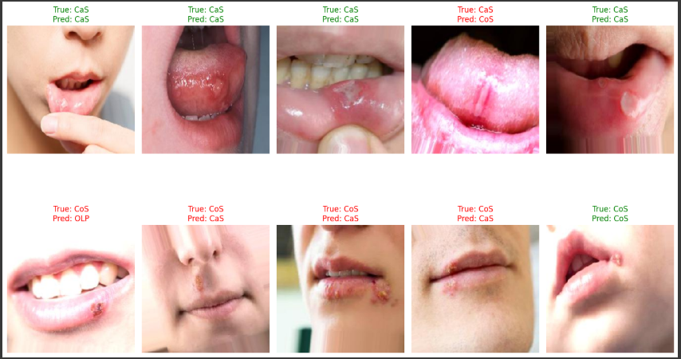

# 🦷 Teeth Disease Classification

This project develops a convolutional neural network (CNN) using TensorFlow/Keras to classify oral and dental images into **7 distinct disease categories**. It is part of an AI-driven healthcare initiative aimed at improving dental diagnostics and patient outcomes.

---

## 📁 Project Structure

```
teeth-disease-classification/
├── data/              # Contains Teeth_Dataset with Training, Validation, Testing folders
├── model/             # Trained model file (e.g., teeth_model.h5)
├── notebooks/         # Main Jupyter Notebook used for training and evaluation
├── images/            # Saved output images (accuracy, loss, predictions)
├── README.md          # Project overview and usage instructions (this file)
```

---

## 🧠 Disease Classes

- `CaS` — Canker Sores  
- `CoS` — Cold Sores  
- `Gum` — Gum Disease  
- `MC`  — Mouth Cancer  
- `OC`  — Oral Cysts  
- `OLP` — Oral Lichen Planus  
- `OT`  — Other Lesions  

---

## 🧪 Model Overview

- Built with **TensorFlow/Keras**
- Trained from scratch on image dataset
- Uses **data augmentation** to improve generalization
- Accuracy evaluated on separate validation and test sets

---

## 📈 Accuracy and Loss over Epochs

These plots show the model's performance as training progresses.

### Accuracy over Epochs


### Loss over Epochs


---

## 🖼️ Sample Predictions

Example test images and the model’s predictions.

- ✅ Green = Correct  
- ❌ Red = Incorrect  



---

## 🚀 How to Run

1. Clone the repository:
   ```bash
   git clone https://github.com/YOUR_USERNAME/teeth-disease-classification.git
   ```

2. Open the Jupyter notebook:
   ```bash
   cd teeth-disease-classification/notebooks
   jupyter notebook
   ```

3. Run `Teeth_Classification.ipynb`

4. (Optional) Replace `data/Teeth_Dataset/` with your own image folders.

---

## 💾 Model File

To reuse the trained model:

```python
from tensorflow.keras.models import load_model
model = load_model('model/teeth_model.h5')
```

---

## 📌 Requirements

- TensorFlow
- NumPy
- Matplotlib
- scikit-learn
- PIL / Pillow

---

## 📬 Contact

For questions or collaborations, feel free to open an issue or contact me directly.
